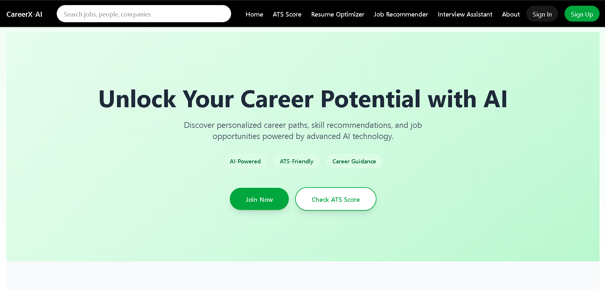

## CareerX-AI — Full Stack Setup (Backend + Frontend)

This workspace contains:

- **backend/** — Spring Boot API (JWT auth + secured endpoints)
- **frontend/** — React + Vite + Tailwind UI

---

## Folder Structure (high level)

```
application/
  backend/
  frontend/
  README.md
```

---

## Prerequisites

Install these once on your machine:

### Backend

- **Java 21** (JDK)
- **Maven 3.9+** (or use your IDE’s bundled Maven)
- **MySQL 8.x** (for running the app locally)

### Frontend

- **Node.js 18+** (recommended 20+)
- npm (ships with Node)

---

## Configuration (Environment Variables)

The backend reads configuration from environment variables.

### Required

- `DB_USERNAME` (default: `root`)
- `DB_PASSWORD` (**required**)
- `JWT_SECRET` (**required**, must be **>= 32 characters** for HS256)

### Optional

- `DB_URL` (if you want to override the JDBC URL)
- `JWT_EXPIRATION_MS` (token lifetime)

#### PowerShell (Windows)

```powershell
$env:DB_USERNAME = "root"
$env:DB_PASSWORD = "<your-mysql-password>"
$env:JWT_SECRET = "<use-a-32+-character-secret>"
```

#### CMD (Windows)

```bat
set DB_USERNAME=root
set DB_PASSWORD=<your-mysql-password>
set JWT_SECRET=<use-a-32+-character-secret>
```

#### macOS / Linux

```bash
export DB_USERNAME=root
export DB_PASSWORD='<your-mysql-password>'
export JWT_SECRET='<use-a-32+-character-secret>'
```

Notes:

- If you start the backend from the **VS Code Run button / IDE**, you may need to set env vars in the run configuration (not only in a terminal).
- Keep `JWT_SECRET` private. Do not commit it.

---

## Recommended Local Dev Setup (Spring Profile: `local`)

If you don’t want to set env vars every time, the recommended approach is to use a **local-only Spring profile file** that is **gitignored**.

What you do:

1. Copy the template:

```powershell
Copy-Item backend\src\main\resources\application-local.properties.example backend\src\main\resources\application-local.properties
```

2. Edit `backend/src/main/resources/application-local.properties` and set your real local values (DB password, JWT secret).

3. Run backend with the local profile:

```powershell
cd backend
mvn spring-boot:run -Dspring-boot.run.profiles=local
```

### Run From VS Code (no env-var confusion)

This repo includes a VS Code Run/Debug configuration that launches the backend with `-Dspring.profiles.active=local`.

Steps:

1. Make sure you created `backend/src/main/resources/application-local.properties` (copy from the `.example` file).
2. Open **Run and Debug** in VS Code.
3. Select **Backend (local profile)** and press Run.

Why this is “best practice”:

- Secrets stay out of git (safe)
- Local dev is convenient (no repeated env var setup)
- Staging/prod can still use real env vars / secret manager

---

## MySQL Setup

1. Ensure MySQL is running
2. Create a database (name can match the JDBC URL configured in backend properties)

Example:

```sql
CREATE DATABASE login_system;
```

If you’re not sure what DB name is configured, check backend `application.properties`.

---

## Run the Project

### 1) Start Backend (Spring Boot)

From the workspace root:

```powershell
cd backend
mvn spring-boot:run
```

Backend runs at:

- `http://localhost:8080`

### 2) Start Frontend (React + Vite)

Open a new terminal from the workspace root:

```powershell
cd frontend
npm install
npm run dev
```

Frontend runs at:

- `http://localhost:5173`

The frontend is configured to call the backend via `/api/...` (Vite dev proxy).

---

## Test / Build

### Backend Tests

```powershell
cd backend
mvn test
```

Tests use an in-memory H2 database so you don’t need MySQL just to run tests.

### Frontend Lint / Build

```powershell
cd frontend
npm run lint
npm run build
```

---

## API Quick Reference

### Register

`POST /api/v1/auth/register`

```json
{
  "firstName": "Noorain",
  "lastName": "K",
  "email": "user@example.com",
  "password": "secret123"
}
```

Response:

```json
{ "token": "<jwt>" }
```

### Login

`POST /api/v1/auth/login`

```json
{ "email": "user@example.com", "password": "secret123" }
```

Response:

```json
{ "token": "<jwt>" }
```

### Current User (Protected)

`GET /api/v1/users/me`

Header:

`Authorization: Bearer <jwt>`

Response:

```json
{
  "email": "user@example.com",
  "firstName": "Noorain",
  "lastName": "K",
  "role": "USER"
}
```

---

## Troubleshooting

### MySQL error: `Access denied` / `using password: NO`

- `DB_PASSWORD` is not set (or not visible to the process you launched).
- Fix: set env vars in the same terminal where you run `mvn spring-boot:run`, or set them in your IDE Run/Debug configuration.

### JWT error: secret too short

- `JWT_SECRET` must be at least 32 characters.

### Port already in use

- Backend uses `8080`, frontend uses `5173`. Stop the existing process or change ports.
